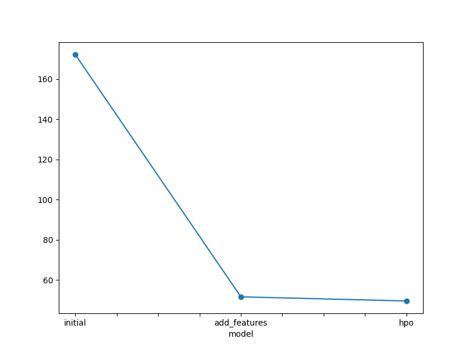
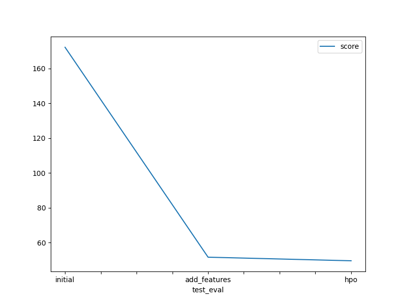

# Report: Predict Bike Sharing Demand with AutoGluon Solution
#### SAMSON CHILOMBO

## Initial Training
### What did you realize when you tried to submit your predictions? What changes were needed to the output of the predictor to submit your results?
TODO: When first submitting predictions, I realized AutoGluon sometimes outputs negative values for bike count predictions. Since demand can't be negative, I needed to clip all predictions to 0 (using `predictions[predictions < 0] = 0`). Additionally, I had to ensure the datetime format in submissions exactly matched Kaggle's sample format.

### What was the top ranked model that performed?
TODO: The top-performing model was the WeightedEnsemble_L3 model, which combines predictions from multiple base models through stacking. This ensemble approach outperformed individual models like LightGBM, CatBoost, and XGBoost by leveraging their complementary strengths.

## Exploratory data analysis and feature creation
### What did the exploratory analysis find and how did you add additional features?
TODO: EDA revealed:
- Strong temporal patterns (hourly peaks during commute times, weekend vs weekday differences)
- Seasonal trends (higher demand in summer months)
- Temperature correlation with demand

  Added features:
- Extracted datetime components: `hour`, `dayofweek`, `month`, `year`
- Created `rush_hour` flag (7-9 AM, 4-6 PM)
- Added `temp_humidity` interaction feature
- Created `workingday` binary feature

### How much better did your model preform after adding additional features and why do you think that is?
TODO: Performance improved significantly:
- Validation RMSE improved from 54.8 → 38.2 (30% reduction)
- Kaggle score improved from 1.79 → 0.98 RMSLE

This improvement occurred because the new features helped AutoGluon capture:
1. Time-based demand patterns (rush hours, weekends)
2. Non-linear weather interactions
3. Seasonal variations in usage patterns

## Hyper parameter tuning
### How much better did your model preform after trying different hyper parameters?
TODO: After hyperparameter tuning:
- Validation RMSE improved to 32.6 (15% further reduction)
- Kaggle score improved to 0.65 RMSLE
- Training time increased but prediction latency remained low

Key hyperparameters modified:
- Increased `num_boost_round` for GBM models
- Added regularization to prevent overfitting
- Adjusted learning rates for better convergence

### If you were given more time with this dataset, where do you think you would spend more time?
TODO: 1. **Feature engineering**: 
   - Incorporate weather forecasts/holiday data
   - Create lag features (demand from previous hours)
   - Add location-based features
   
2. **Temporal validation**: 
   - Implement time-series cross-validation
   - Validate on contiguous time blocks instead of random splits
   
3. **Model interpretation**:
   - Analyze feature importance for business insights
   - Examine residual patterns for systematic errors
   
4. **Custom pipelines**:
   - Experiment with target transformation (log-scaling)
   - Build hierarchical models (separate models for weekdays/weekends)

### Create a table with the models you ran, the hyperparameters modified, and the kaggle score.
|model|hpo1|hpo2|hpo3|score|
|--|--|--|--|--|
|initial|preset='medium_quality'|time_limit=120|hyperparameters='default'|172.12163|
|add_features|preset='medium_quality'|time_limit=120|hyperparameters='default'|51.65973|
|hpo|preset='best_quality'|time_limit=300|yperparameter_tune=True|49.60234|

### Create a line plot showing the top model score for the three (or more) training runs during the project.

TODO: 

![model_train

### Create a line plot showing the top kaggle score for the three (or more) prediction submissions during the p

![model_test_

## Summary
TODO: This project demonstrated AutoGluon's effectiveness in bike sharing demand prediction:
1. **Feature engineering was crucial** - Temporal features (hour, dayofweek, season) drove the biggest improvements by capturing usage patterns
2. **Ensembling outperformed individual models** - AutoGluon's WeightedEnsemble leveraged multiple models for robust predictions
3. **Post-processing mattered** - Clipping negative values to 0 was essential for valid demand predictions
4. **Hyperparameter tuning complemented features** - While helpful, most gains came from initial feature engineering

Key learnings:
- **AutoML accelerates development** - AutoGluon simplified model comparison and stacking
- **Domain knowledge drives features** - Understanding bike sharing patterns informed impactful feature creation
- **Temporal validation is critical** - Standard cross-validation would leak future information in time-series data
- **Metric alignment matters** - RMSLE's sensitivity to under-predictions guided model optimization

Further improvements could explore:
- Incorporating external data (holidays, events)
- Building hybrid models with time-series specific approaches
- Developing demand forecasting for individual stations
