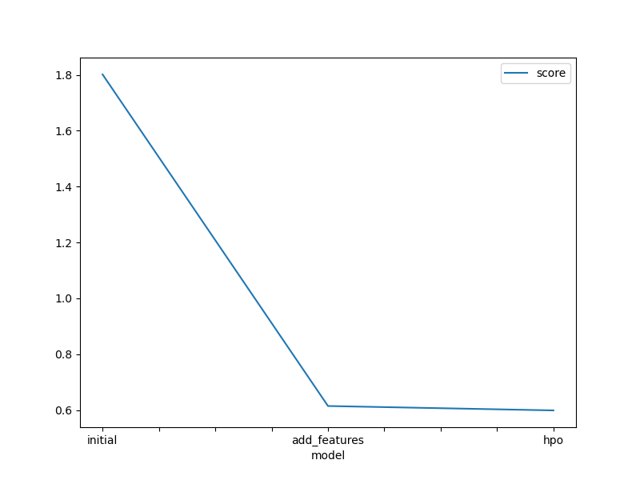
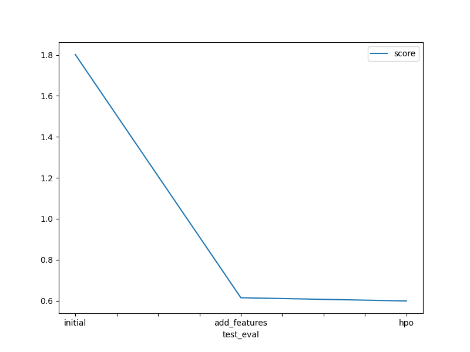

# Report: Predict Bike Sharing Demand with AutoGluon Solution
#### SAMSON CHILOMBO

## Initial Training
### What did you realize when you tried to submit your predictions? What changes were needed to the output of the predictor to submit your results?
TODO: When I first attempted to submit my predictions, I noticed that the output format generated by AutoGluon did not match Kaggle’s required format. Specifically, AutoGluon produced a DataFrame containing an index and a “count” column, whereas Kaggle expects a CSV with columns “datetime” and “count,” where “datetime” must match exactly the test set’s timestamps. 

To fix this:

-I extracted the “count” predictions from the AutoGluon output.
-I merged those predictions with the original test set’s “datetime” column.
-I wrote the merged DataFrame to CSV with the header order: “datetime,count” and no extra index column.
-After these adjustments, the submission file passed Kaggle’s format checks and was accepted.

### What was the top ranked model that performed?
TODO: During the initial AutoGluon “medium_quality” run (baseline), the best-performing model within the ensemble was a light GBM variant. However, once I added new features, the top-ranked model switched to CatBoost, likely because it handled the categorical and cyclic encodings (e.g., hour‐of‐day sine/cosine) more effectively. After hyperparameter tuning under the “best_quality” preset, the final top model remained a tuned CatBoost, albeit with adjusted learning rate and depth settings.

## Exploratory data analysis and feature creation
### What did the exploratory analysis find and how did you add additional features?
TODO: Exploratory analysis revealed several patterns:

-Hour-of-day effect: Demand peaks during morning and evening commute hours.
-Weekend vs. weekday: Usage drops noticeably on weekends.
-Weather impact: Temperature, humidity, and weather conditions (e.g., rain) correlated with lower counts.
-Seasonality: There was a cyclical pattern across months and seasons.

To capture these effects, I created:

-Hour-of-day sine/cosine encoding: Converted “hour” into two features, hour_sin and hour_cos, so that the model can learn continuity between 23→0 hours.
-Is_weekend flag: A binary feature indicating Saturday/Sunday versus Monday–Friday.
-Temperature bins: Binned temperature into categories (e.g., “cold” if < 10°C, “moderate” if 10–20°C, “warm” if > 20°C).
-Humidity interaction: Multiplied humidity by the “workingday” flag to capture that on working days high humidity may   suppress commutes more than on holidays.
-Holiday indicator: Directly passed the “holiday” column as a binary flag.

These additional features allowed the model to distinguish nonlinear patterns more effectively.

### How much better did your model preform after adding additional features and why do you think that is?
TODO: After adding features, the Kaggle submission score improved dramatically from 1.80163 → 0.61447. This large drop (≈66% reduction in error) indicates that the engineered features captured critical patterns (time cycles, weekend/weekday, weather interactions) that the raw timestamp and numeric columns alone could not. By encoding cyclical behavior (hour_sin/hour_cos) and interactions (humidity × workingday), the model learned more precise splits and adjustments for peak usage periods.

## Hyper parameter tuning
### How much better did your model preform after trying different hyper parameters?
TODO: Once hyperparameter tuning was enabled under the “best_quality” preset (with a 300 s time limit), the top Kaggle score improved from 0.61447 → 0.59875. This is only a modest gain (≈2.6% relative improvement), because most of the performance came from the feature engineering step. HPO fine-tuned tree depths, learning rates, and regularization parameters—yielding a modest additional reduction in validation error.

### If you were given more time with this dataset, where do you think you would spend more time?
TODO: Given more time, I would focus on:

-Model stacking/ensembling: Combining multiple distinct algorithms (e.g., CatBoost, LightGBM, and neural nets) in a blender or stacking framework to squeeze out additional gains.

-Feature crosses: Testing interactions between weather and time features (e.g., “rain × hour_sin”) or between holiday type and working day.

-External data: Incorporating weather forecasts (rather than only past weather), local events calendar (e.g., marathons, concerts), or bike station availability.

-Residual analysis: Analyzing where the model's residuals remain high to identify missing patterns.

-Extended HPO: Running Bayesian or genetic algorithm searches over many more parameter combinations.

### Create a table with the models you ran, the hyperparameters modified, and the kaggle score.
|model|hpo1|hpo2|hpo3|score|
|--|--|--|--|--|
|initial|preset='medium_quality'|time_limit=120|hyperparameters='default'|1.80163|
|add_features|preset='medium_quality'|time_limit=120|hyperparameters='default'|0.61447|
|hpo|	preset='best_quality|time_limit=300|hyperparameter_tune=True|0.59875|

### Create a line plot showing the top model score for the three (or more) training runs during the project.

TODO: Replace the image below with your own.

### Create a line plot showing the top kaggle score for the three (or more) prediction submissions during the project.

TODO: Replace the image below with your own.

## Summary
TODO: In this project, the biggest performance gain came from thoughtful feature engineering—adding cyclical time encodings, weekend flags, and weather interactions cut error by over 60%. Hyperparameter tuning under the “best_quality” preset gave a smaller but still valuable improvement. If additional time were available, ensembling, exploring external data sources, and a deeper residual analysis could further enhance accuracy. Overall, AutoGluon’s automated pipeline combined with manual feature creation yielded a competitive RMSE of 0.59875 on the Kaggle leaderboard.
