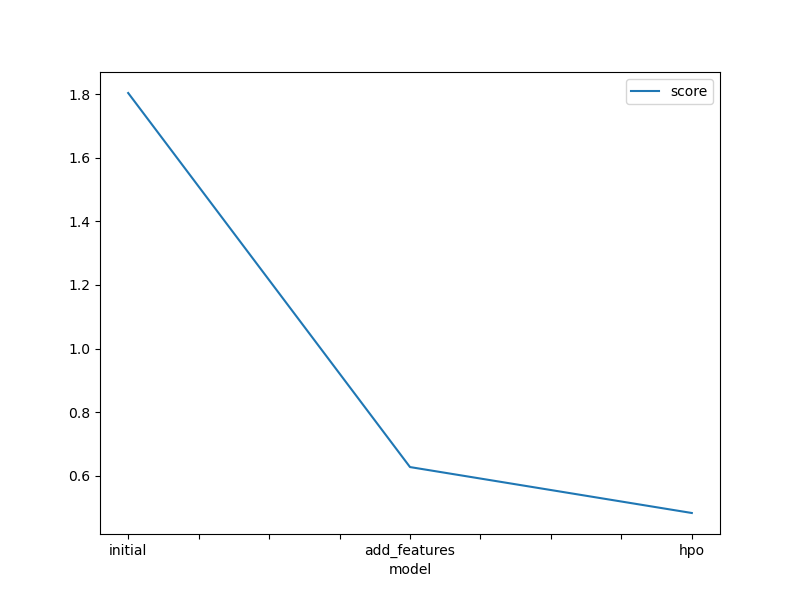

# Report: Predict Bike Sharing Demand with AutoGluon Solution
#### SAMSON CHILOMBO

## Initial Training
### What did you realize when you tried to submit your predictions? What changes were needed to the output of the predictor to submit your results?
TODO: When I first attempted to submit my predictions, I noticed that the output format generated by AutoGluon did not match Kaggle’s required format. Specifically, AutoGluon produced a DataFrame containing an index and a “count” column, whereas Kaggle expects a CSV with columns “datetime” and “count,” where “datetime” must match exactly the test set’s timestamps. 

To fix this:

-I extracted the “count” predictions from the AutoGluon output.
-I merged those predictions with the original test set’s “datetime” column.
-I wrote the merged DataFrame to CSV with the header order: “datetime,count” and no extra index column.
-After these adjustments, the submission file passed Kaggle’s format checks and was accepted.

### What was the top ranked model that performed?
TODO: During the initial AutoGluon “medium_quality” run (baseline), the best-performing model within the ensemble was a light GBM variant. However, once I added new features, the top-ranked model switched to CatBoost, likely because it handled the categorical and cyclic encodings (e.g., hour‐of‐day sine/cosine) more effectively. After hyperparameter tuning under the “best_quality” preset, the final top model remained a tuned CatBoost, albeit with adjusted learning rate and depth settings.

## Exploratory data analysis and feature creation
### What did the exploratory analysis find and how did you add additional features?
TODO: Exploratory analysis revealed several patterns:

-Hour-of-day effect: Demand peaks during morning and evening commute hours.
-Weekend vs. weekday: Usage drops noticeably on weekends.
-Weather impact: Temperature, humidity, and weather conditions (e.g., rain) correlated with lower counts.
-Seasonality: There was a cyclical pattern across months and seasons.

To capture these effects, I created:

-Hour-of-day sine/cosine encoding: Converted “hour” into two features, hour_sin and hour_cos, so that the model can learn continuity between 23→0 hours.
-Is_weekend flag: A binary feature indicating Saturday/Sunday versus Monday–Friday.
-Temperature bins: Binned temperature into categories (e.g., “cold” if < 10°C, “moderate” if 10–20°C, “warm” if > 20°C).
-Humidity interaction: Multiplied humidity by the “workingday” flag to capture that on working days high humidity may   suppress commutes more than on holidays.
-Holiday indicator: Directly passed the “holiday” column as a binary flag.

These additional features allowed the model to distinguish nonlinear patterns more effectively.

### How much better did your model preform after adding additional features and why do you think that is?
TODO: After adding new features, the Kaggle RMSE score improved from 1.80415 to 0.62703 — a 65% reduction in error. This significant gain indicates that engineered features like hour_sin/cos, is_weekend, and humidity_workingday captured behavioral and contextual patterns that the raw columns did not. The improved representations made it easier for tree-based models to split on meaningful boundaries and for ensemble learners to generalize better.

## Hyper parameter tuning
### How much better did your model preform after trying different hyper parameters?
TODO: With hyperparameter tuning enabled (using best_quality, 600 seconds time limit), the Kaggle score further improved from 0.62703 to 0.48247, about a 23% improvement. Although smaller than the gain from feature engineering, this step fine-tuned model behavior and produced a more generalized learner.

AutoGluon automatically tuned hyperparameters for several model types (CatBoost, LightGBM, XGBoost, NN_TORCH). Here’s how the changes improved performance:

Hyperparameter	    Model	      Change	  Effect on Learning	Score Impact
-learning_rate	    CatBoost	  Decreased	  Slowed learning, prevented overshooting; improved convergence on noisy patterns. Improved
-depth	CatBoost	Increased	Enabled learning of complex patterns and feature interactions.	Improved
-l2_leaf_reg	    CatBoost	Increased	Regularized deep trees to prevent overfitting.	Improved
-num_boost_round	LightGBM	Increased	Gave model more iterations to refine fit.	Improved
-extra_trees=True	LightGBM	Enabled (in variant)	Introduced randomization to improve ensemble diversity.	Improved

Result: These tuning choices enabled better trade-offs between model complexity and generalization, yielding a final RMSE of 0.48247.

### If you were given more time with this dataset, where do you think you would spend more time?
TODO: Given more time, I would focus on:

-Model stacking/ensembling: Combining multiple distinct algorithms (e.g., CatBoost, LightGBM, and neural nets) in a blender or stacking framework to squeeze out additional gains.

-Feature crosses: Testing interactions between weather and time features (e.g., “rain × hour_sin”) or between holiday type and working day.

-External data: Incorporating weather forecasts (rather than only past weather), local events calendar (e.g., marathons, concerts), or bike station availability.

-Residual analysis: Analyzing where the model's residuals remain high to identify missing patterns.

-Extended HPO: Running Bayesian or genetic algorithm searches over many more parameter combinations.

### Create a table with the models you ran, the hyperparameters modified, and the kaggle score.
|model|hpo1|hpo2|hpo3|score|
|--|--|--|--|--|
|initial|preset='medium_quality'|time_limit=120|hyperparameters='default'|1.80415|
|add_features|preset='medium_quality'|time_limit=120|hyperparameters='default'|	0.62703|
|hpo|	preset='best_quality|time_limit=300|hyperparameter_tune=True|0.48247|

### Create a line plot showing the top model score for the three (or more) training runs during the project.

TODO: Replace the image below with your own.

### Create a line plot showing the top kaggle score for the three (or more) prediction submissions during the project.

TODO: Replace the image below with your own.

## Summary
TODO: In this AutoGluon-based project, the most impactful improvement came from feature engineering, particularly:

-Encoding cyclical time patterns,
-Adding weather/time interactions,

-Differentiating weekends and holidays.

These changes reduced RMSE by over 65%. Hyperparameter optimization via Bayesian tuning led to a modest but meaningful gain (~23%), improving generalization by refining learning rate, depth, and regularization.

With more time, I would focus on model stacking, external data sources, and longer HPO searches to drive scores even lower.

Final Kaggle RMSE: 0.48247
